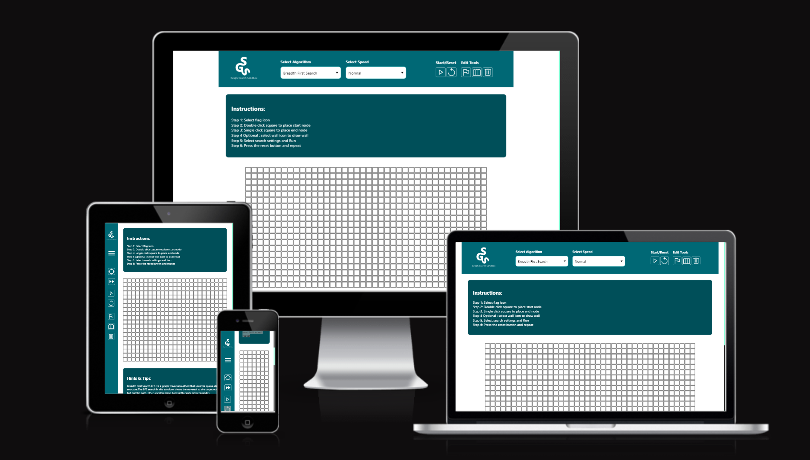
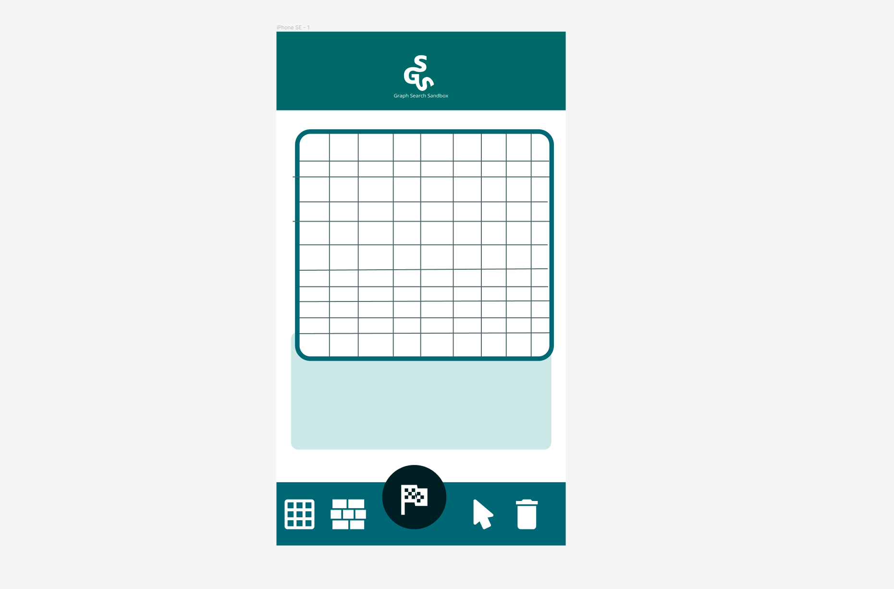
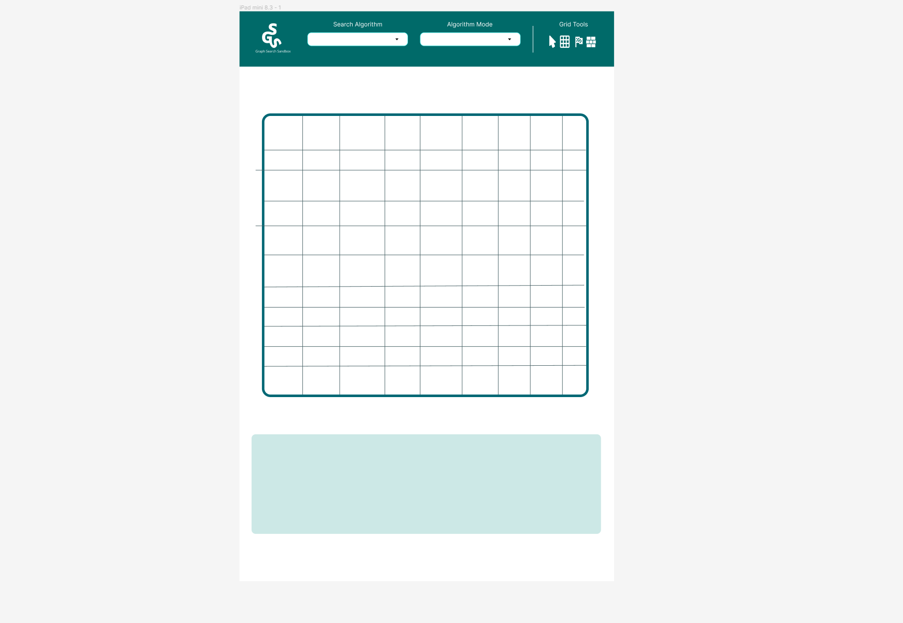
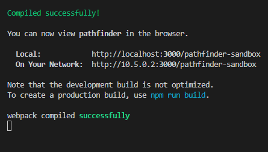

# Graph Search Sandbox

## About

### Background

I decided to create this project to better my understanding of graph search algorithms. When first studying data structures and algorithms I found it difficult to visualise how slight differences in algorithms could impact search characteristics. As such I have created a this sand box to enable others to visualize some common algorithms, namely breadth first search, depthfirst search and the more advance Dijkstra’s search algorithm.

### Purpose

The Graph search sandbox is a web app created with react js framework, is a page for learners of data structures and algorithms with a focus on graph algorithms to develop an application for the nuance of different search algorithms by interactively utilising them. The sandbox does this by providing users the ability to place start and end node, place walls and a selection of three algorithms to provide users with variety of visualisations of searches.scape to encourage exploration including but not limited to: History, Information on tea blends and recipes.

## 

## Technologies

- HTML Formatter: used to format HTML pages and ensure reliability and maintainability of code and features
- Figama: used to create the design of the website and constituent pages
- CSS: used to style HTML pages and create responsive and intuitive UX
- HTML: used to create the components that made up the website
- VS Code: IDE used to develop the site
- Git: used for version control of the website and creating a local repo.
- GitHub: used as a remote repo to store the commits of the project in a place that can be shared.
- GitHub Pages: part of github used to host the website file and create a live project
- Prettier: vs code extension used to format code
- MS Word: used to spell check content and remove typos
- Material Theme Builder: used to develop colour pallet for website and ensure Accessibility would persist
- Monokai++: an addon in vs code used to make interpreting code easier and development more efficient
- Live Server : an addon in vs code that enabled a local server on the 127.0.0.1 port to host the website and view the pages and components during development
- Canva: was used to create the website logo in svg and png formats for use on the page.
- Creacte React App: used to create react app template and build react app
- Google Fonts: used to import the Roboto font for use in website theme

---

## Design

### Wireframes

- The wireframe for the full website was used to develop the responsive views of the web application.
  And develop the required react components necessary to fulfil the design and achieve desired functionality. Designing the app helped to speed up the implementation stage.

- The design of the site evolved as the project went on. this was due to time limitations and a desire to minimise complexity while maximising UX

- Below are the wire frames for the site on mobile, desktop and tablet:
  
  
  

### Themes

- The focus of this project being an interactive sandbox with may components it was necessary that all components would be highlighted but not clash or be abrasive to the eye. Hence the colour theme was a muted pallet

### Images

- Images used in the site are royalty free SVGs from google fonts website

### Layout

- The website uses a simple grid layout with all content being in rounded rectangular cards. This creates a modular and uniform feel

---

## Features

### Navigation

- Navbar

  - Consists of the logo and UI tools for interacting with the website.
  - The navbar sits at the top of the page and has fullsized icons and dropdowns for enhanced UX .
  - The navbar is multi layer that enables users to navigate to different pages of the same topic
  - The navbar has hover effects to help the user navigate understand what tool is active

- Sidebar

  - Consists of the logo and UI tools for interacting with the website.
  - The navbar sits on the left of the page and has icons and expanded display state to show dropdowns for enhanced UX .
  - The navbar has hover effects to help the user navigate understand what tool is active.
  - The sidebar is the navigation device for smaller screen devices.

- Instructions
  - Instructions above grid tell users how to interact with web app for clean UX.
  - Instructions are located in banner card above main user area to ensure users are informed and create a smooth user story.

## Testing &amp; Validation

- The website was tested in Chrome, Mozilla and Opera browser. All features are supported and page maintained functionality.
- The website was tested on both desktop and mobile devices. The page is responsive to a screen width of 320px
- Dev tools used to emulate all devices from desktop to small mobile range to secure responsiveness.
- Changes can be seen in the evolution of commits. Commits show refining of scope of project to current version.
- Accessibility of the page was assessed using the in browser Lighthouse report. Report highlights can be seen below.

  

- [HTML Validator from w3 schools](https://validator.w3.org) was attempted ti be used on html from web page but as react app useses templates no errors seen. SUCCESS on all pages

- [Jigsaw CSS validator](https://jigsaw.w3.org/css-validator/) was used to validate CSS stylesheets. SUCCESS no errors found in files

- React App has a built in compiler and lint that provides warnings if code is not clear . SUCCESS no compliation errors detected

## Responsive

- All pages are fully responsive on all devices down to a minimum screen width of 320px

---

## Bugs

-

- After running the search algorithm if the dropdown was selected it would appear in between nodes.
  This was resolved by in creasing the Z-index for the dropdowns

- The two dropdowns were created by using a custom created generic component. They could not return two different states because of this. By using the same prop with different setter functions we were able to use the same component to set different state variables.

- When trying to animate Dijkstra’s visited nodes and then optimal path both would load at the same time despite using set interval and having I be the length of the first loop to trigger the second. This was resolved by delaying the set interval of the optimal path animate in the set Interval function by the length of the first visited nodes list and time interval this meant for any size the shortest path could be animated after

---

## Deployment

- The project was developed in VS Code to gain experience developing code in a commonly found IDE.
- I created all the basic folders and files I needed for the webpage including html files for all web pages, and css stylesheet.
- In VS Code after creating a new terminal the repository was inialised with the git init command
- using git add . followed by git commit -m "initial commit" the files were staged and committed to the local repo
- In github I created a new repo for the project and linked the remote repo the local VS code environment which enabled a CI/CD workflow for the project.

- In VS code I installed gh pages via nmp
- In the package.json file I added homepage, and deploy and predelpoy in scripts
- In the terminal I ran deploy
- Project deployed on github pages to [here](https://sabgibson.github.io/pathfinder-sandbox/)

---

## Credits

### Persons

- Reuben Ferrante - for constructive feedback and insight on resources to develop the project
- Google Fonts - for royalty free icons used in the site
- CI community - for support throughout the project

### Research Materials

These were used to find out more about algorithims used in the site:

- [Dijkstra Algorithm](https://youtu.be/XB4MIexjvY0)
- [BFS](https://youtu.be/pcKY4hjDrxk)
- [DFS](https://youtu.be/7fujbpJ0LB4)
- [Source 4](https://www.whittard.co.uk/)
- [Source 5](https://www.mariagefreres.com/UK/welcome.html)
- [Source 6](https://twgtea.com)

### Technology

Technologies used during the project can be found here:

- [Canva](https://www.canva.com/)
- [Figma](https://www.figma.com/)
- [Github](https://github.com/)
- [MDN Web Docs](https://developer.mozilla.org)
- [Google Fonts](https://fontawesome.com)

---

## Licences &amp; Copyright

All resources used in this project are under free use policies.
The use of the resources in this project do not infract on the fair uses or terms of use of these resources

---

## React App

# Getting Started with Create React App

This project was bootstrapped with [Create React App](https://github.com/facebook/create-react-app).

## Available Scripts

In the project directory, you can run:

### `npm start`

Runs the app in the development mode.\
Open [http://localhost:3000](http://localhost:3000) to view it in your browser.

The page will reload when you make changes.\
You may also see any lint errors in the console.

### `npm test`

Launches the test runner in the interactive watch mode.\
See the section about [running tests](https://facebook.github.io/create-react-app/docs/running-tests) for more information.

### `npm run build`

Builds the app for production to the `build` folder.\
It correctly bundles React in production mode and optimizes the build for the best performance.

The build is minified and the filenames include the hashes.\
Your app is ready to be deployed!

See the section about [deployment](https://facebook.github.io/create-react-app/docs/deployment) for more information.

### `npm run eject`

**Note: this is a one-way operation. Once you `eject`, you can't go back!**

If you aren't satisfied with the build tool and configuration choices, you can `eject` at any time. This command will remove the single build dependency from your project.

Instead, it will copy all the configuration files and the transitive dependencies (webpack, Babel, ESLint, etc) right into your project so you have full control over them. All of the commands except `eject` will still work, but they will point to the copied scripts so you can tweak them. At this point you're on your own.

You don't have to ever use `eject`. The curated feature set is suitable for small and middle deployments, and you shouldn't feel obligated to use this feature. However we understand that this tool wouldn't be useful if you couldn't customize it when you are ready for it.

## Learn More

You can learn more in the [Create React App documentation](https://facebook.github.io/create-react-app/docs/getting-started).

To learn React, check out the [React documentation](https://reactjs.org/).

### Code Splitting

This section has moved here: [https://facebook.github.io/create-react-app/docs/code-splitting](https://facebook.github.io/create-react-app/docs/code-splitting)

### Analyzing the Bundle Size

This section has moved here: [https://facebook.github.io/create-react-app/docs/analyzing-the-bundle-size](https://facebook.github.io/create-react-app/docs/analyzing-the-bundle-size)

### Making a Progressive Web App

This section has moved here: [https://facebook.github.io/create-react-app/docs/making-a-progressive-web-app](https://facebook.github.io/create-react-app/docs/making-a-progressive-web-app)

### Advanced Configuration

This section has moved here: [https://facebook.github.io/create-react-app/docs/advanced-configuration](https://facebook.github.io/create-react-app/docs/advanced-configuration)

### Deployment

This section has moved here: [https://facebook.github.io/create-react-app/docs/deployment](https://facebook.github.io/create-react-app/docs/deployment)

### `npm run build` fails to minify
